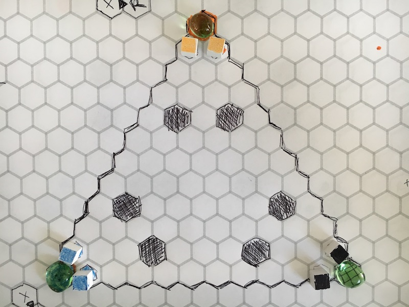

# Snow Fight Board Game

> v.01

Turn based board game on hex grid.

# Starting Rules

- Players
    - 2 pieces each
- Turns
- Barriers
    - barriers block throws
    - can only throw in straight line past barriers
- Capture the flag
    - enter flag space to capture
    - piece carries flag
    - bring flag back to your own to score
    - First to 2 captures wins
    - After capture game carries on from current state
    - Flags with 10 spaces between
- Throwing snowballs
    - Roll d20
    - Ranges, hits on
        - 1 >= 9
        - 2 >= 12
        - Roll of 20 hits and player takes another turn of move/throwing
            - Pieces do not return in extra turn
    - when hit, piece is removed for 1 whole turn (skips next turn)
- returning pieces can be placed adjacent to flag space, player's choice where
- returning pieces can move/throw immediately

## Assets Required

- [Hex grid image](assets/hex-grid.pdf)
- d20
- player pieces/bits
- 3 flag bits

# Playtest 1

- 3 players
- Triangle board
- Flags are 10 spaces apart
- 2 pieces per team

## Rules

- Get flag
    - `Changed`: space next to flag captures, returns
- Own flag returned immediately upon touching by defender
    - `Changed`: Flag must be carried back home, this greatly sped up the game by allowing someone to actually score a goal
- Move 3 spaces
    - Spread across 2 pieces in any order or amount
- Throws:
    - 1 throw per player per turn
        - `Changed`: each piece can throw once per turn

## Observations

- Sped up when each piece could throw
- Timing of when to hit a player matters. Move speed and board means that typically when a flag was captured and the piece starts to return home, the defending player got a piece next turn and immediately gave chase.
    - this means that a lot rode on that first throw by the chasing piece
        - if missed, chase continued and really came down to a hit or not, mostly at range of 1, so odds were good to hit
- Teaming up (2 v 1) is key but difficult to achieve
- Play largely occurred along edges, straight lines between goals
    - open center avoided
    - barriers played a huge role

# Playtest 2

- 4 players
- squarish board
- Each piece can move up to 3 and throw once each turn
- Can move or throw in any order
- Throwing
    - Added throw range 3 >= 17

# Rules to Consider

- Can't move after throw
- Snowball inventory needs to be replenished
    - trade movement for a turn to make snowballs
    - central snowball repository anyone can use

# Cards?

- Get hit, draw card for consequence
- Snowball cards for inventory